# Overview
This guide is meant to be a step by step walkthrough of a fresh installation of Windows Server 2025. The goal is to provide a clear overview of how to properly install the operating system and prepare it for use. Note that this guide only covers the actual installation of the OS and not the initial hypervisor steps.

# Background
- The installation will be peformed via virtualization using a hypervisor and an ISO image
- The hypervisor being used is VMware Workstation Pro
  - The hypervisor can be downloaded for free from [here](https://www.vmware.com/products/desktop-hypervisor/workstation-and-fusion)
  - Note that you must register for a Broadcom account in order to download VMware Workstation Pro
- The ISO image for the Windows Server 2025 operating system comes directly from Microsoft, using their free, 180 day evaluation
  - You can find more information and a download for the ISO image [here](https://www.microsoft.com/en-us/evalcenter/evaluate-windows-server-2025)
  
# Installing the OS
1. Upon booting into Windows, you will first be prompted to choose your preferred language settings. In this case I kept the default settings of **English (United States)**. Once done, click next
   
    

2. Next, you will be prompted to select the preferred language for your keyboard settings. I have kept it as the default setting of **US** English.
   
    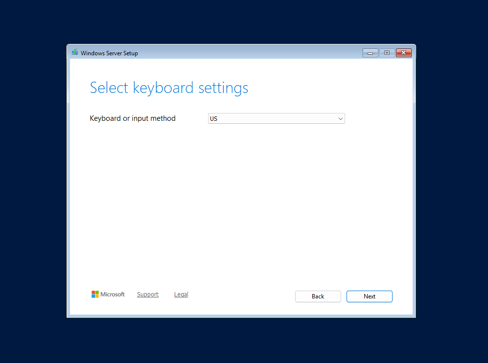

3. At this stage, you will have the option to select whether you would like to perform an install or a repair. **Install Windows Server** will allow you proceed with a fresh install of the OS while **Repair my PC** allows you to run **Windows Startup Repair**, which is a builtin recovery tool that automatically fixes common issues preventing Windows from booting. 
   
   Since we are working on a fresh install, we will go ahead and select **Install Windows Server** and proceed with Next.
   
   Note that you must also check off the **I agree everything will be deleted including files, apps, and settings** before proceeding as a fresh install will overwrite data from a previous installation if present. 

    

4. At this step you will be presented with a list of available operating system editions contained within the ISO file to install. If you prefer a command line based environment, you'll want to stick with just the **Standard Evaluation**. If you wish to have a GUI with a desktop, you'll want to select a **Desktop Experience** option. 
   
   For this example, we will select the **Windows Server 2025 Standard Evaluation (Desktop Experience)** option which will give us a proper desktop.

    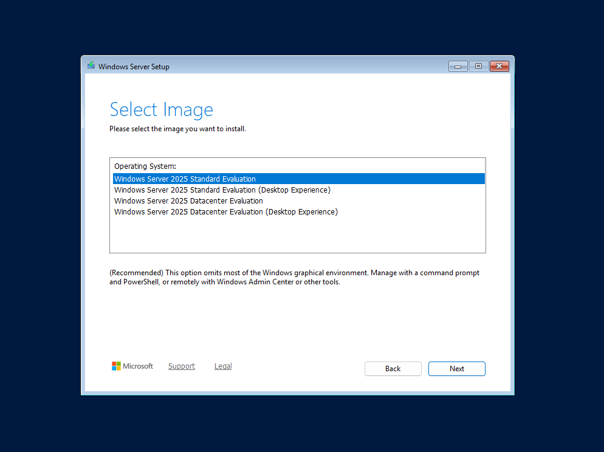

5. Next, you'll be presented with a license agreement which you will need to **Accept** before proceeding.

    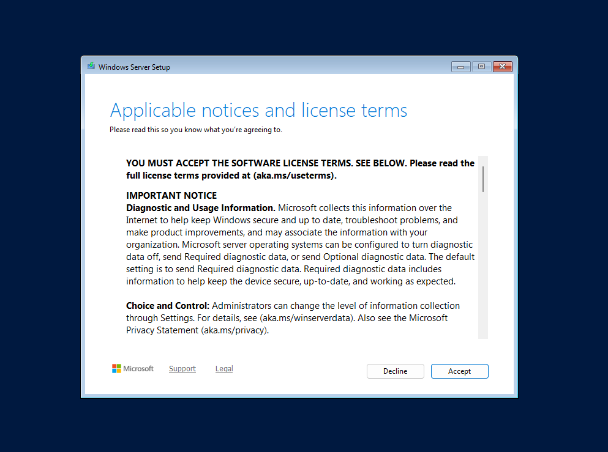

6. Here you will decide where you want to install Windows. If no disks appear, you may need to load/install drivers for your specific storage device. If this does not pertain to you, simply select which drive you would like to install Windows onto. You can also choose to partition the drive as well if need be.
   
   To keep things simple, we will just select **Disk 0** and proceed forward without partitioning. 

    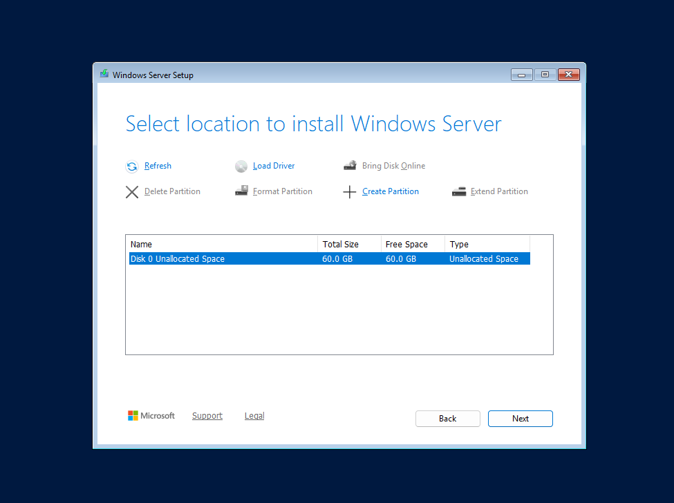

7. Windows will now double check and prompt if you are ready to install. Ensure your chosen settings are correct. If all looks good, click **Install** to begin the installation process.

    

    

8. Once the installation is complete, you will be presented with a page that allows you to set the password for a built in administrator account. This account is a local administrator that you will use to initially log in. 

    

9. Log in as the local **Administrator** account with the password you set. Once logged in, you should be taken to the Desktop which will present Server Manager. At this point, installation is now fully complete and you have a working base installation of Windows Server 2025. Moving forward, you can create additional users and configure domain settings as needed for your environment.

    

# Setting a Static IP Address
At this stage we will set a static IP address for the machine. Since it will act as a Domain Controller, a static configuration is necessary because the rest of the network depends on being able to reliably find the DC at the same address every time.

1. In Server Manager, navigate to **Local Server** and in PROPERTIES, click on the highlighted portion: **IPv4 address assigned by DHCP, IPv6 enabled**. This will take you to **Network Connections** which allows you make changes to the network interface card (NIC) settings. 

    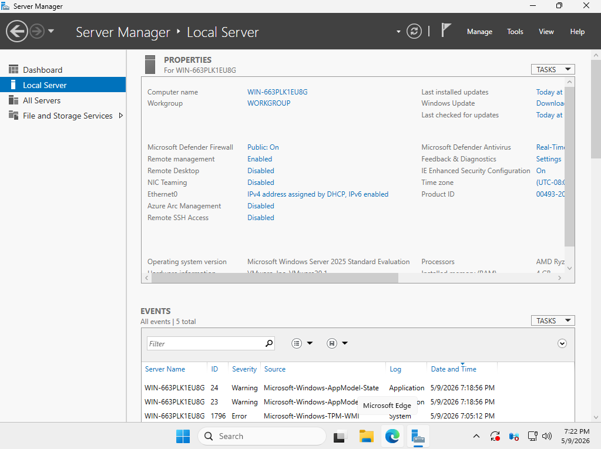

2. Right click on the NIC and select **Properties**. This allows for the editing of settings for that specific NIC.
   
    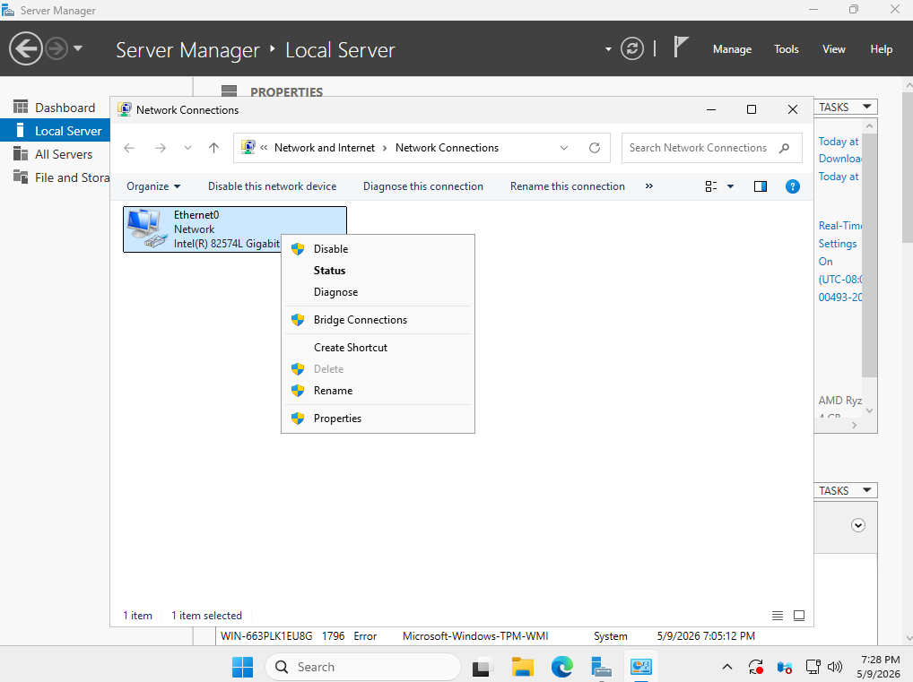

3. In the **Properties** menu, find the **Internet Protocol Version 4 (TCP/IPv4)** item and select **Properties** again. This will allow you to make changes to the IPv4 settings for the current NIC.
   
    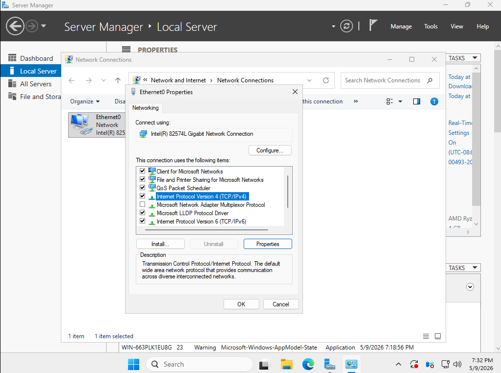

4. Now we'll set the actual static IP address. Click on **Use the following IP address:** and input the necessary information. Address information will differ depending on your environment but in a virtualized one like my own, there is much more leeway in choice. I opted for a **192.168.1.0/24** network in mine.

    We'll also want to configure the DNS settings statically as well. Select **Use the following DNS server addresses:** and set the **Preferred DNS** as the same address you used for the DC from above. Its important that the DC points to itself as DNS will be installed on this machine as well later on. **Alternate DNS server** can be left blank. Click **Ok** to proceed and exit out of all NIC setting menus. This covers static address assignment for the DC
    
    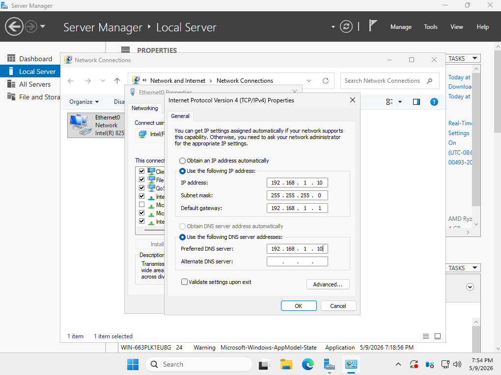

# Setting the Hostname
1. Navigate to **Local Server** and click on **Computer name**. This will bring up the **System Properties** menu for the machine. Note that Windows automatically assigns a default hostname and mine is **WIN-663PLK1EU8G** in this example
 
    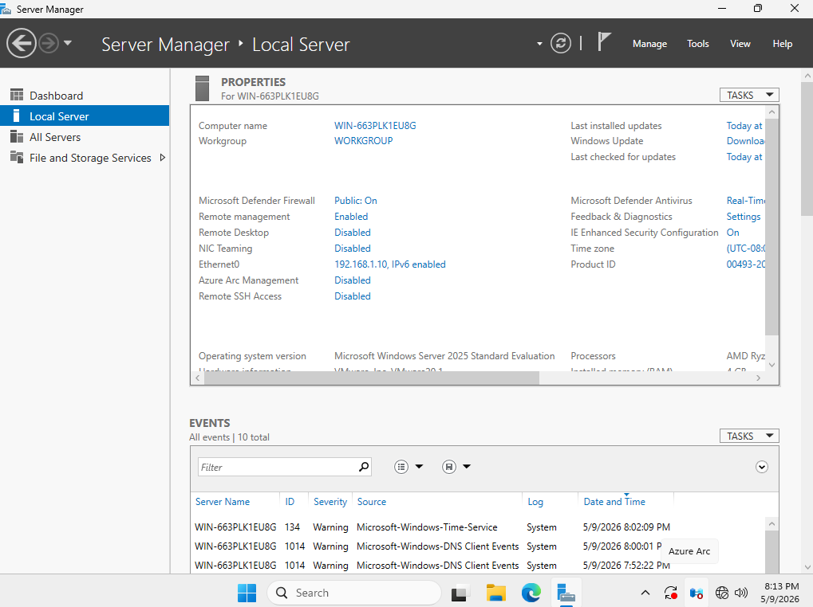

2. Select the **Change** option in **System Properties**. 
    
    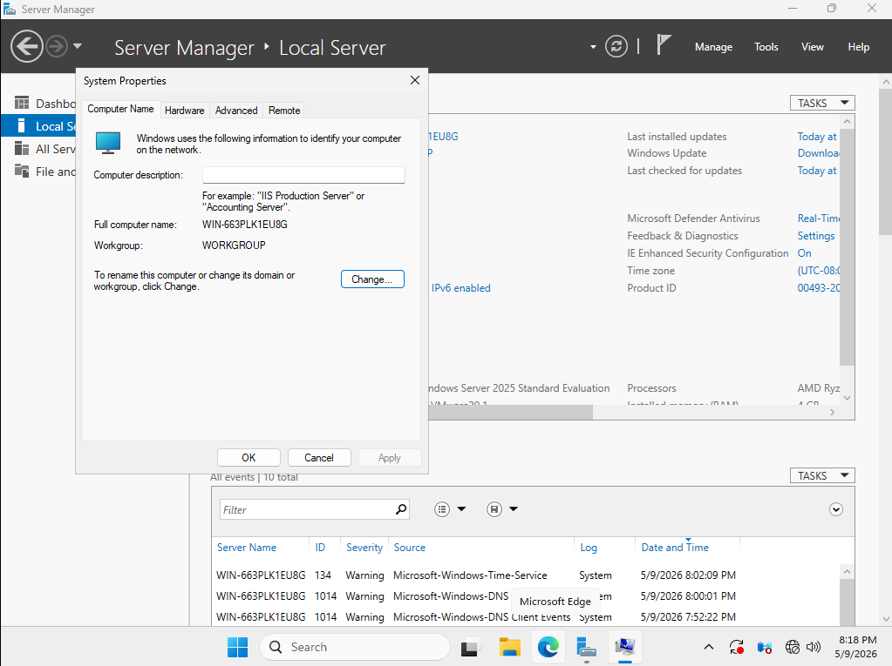

3. You will be taken to the **Computer Name/Domain Changes** menu. In **Computer name**, change the name to your desired name. There is no universal naming conventions for DC's but it should be short and descriptive enough for clear identification. I decided to settle with **InfraDC-01** for this example. You can also make changes to the membership of **Workgroups** or other **Domains** as well but I stuck with the defaults in this case. Click **Ok** when done.

    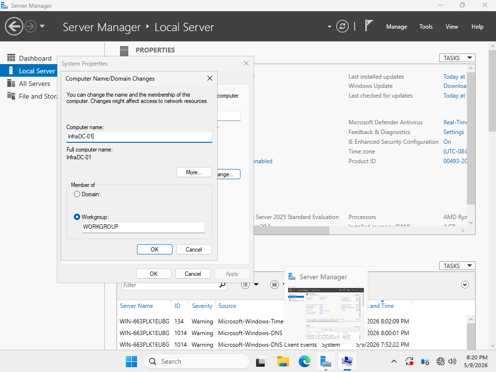

4. Once the name is changed, you can exit out of all the menus. You will be prompted to restart the machine as a hostname change requires a reboot. Upon logging back in and navigating back to **Server Manager**, the new hostname should appear. The hostname has now been successfully changed.

    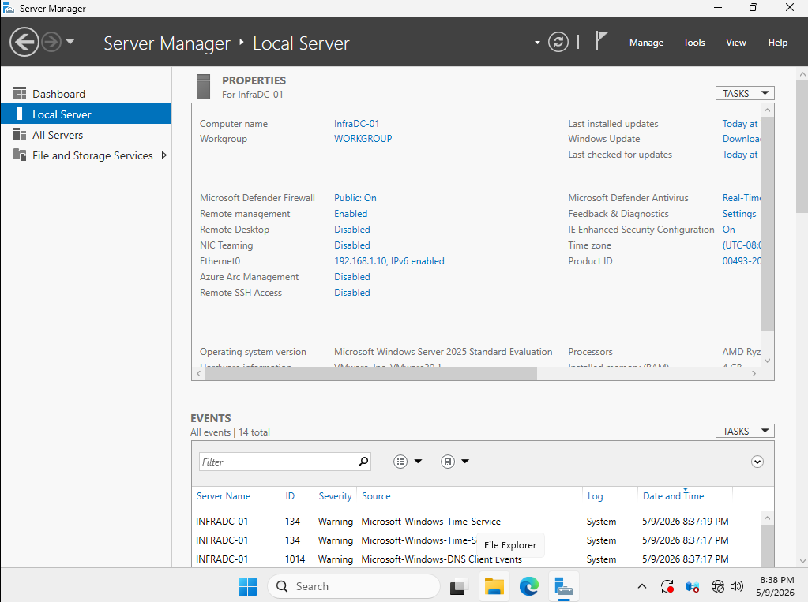

# Updating the OS
1. Navigate to **Local Server** look for where it says **Windows Update**. This will tell you about the current update settings configured as well as when the last updates were installed.
    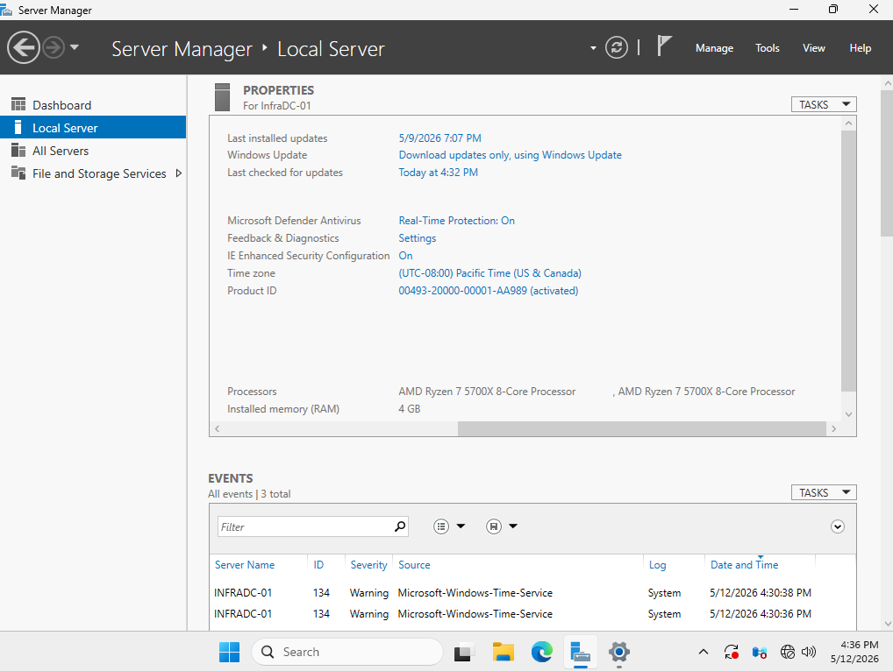

2. Clicking on the provided hyperlink will take you to the Windows Update menu, which will list out any updates that can be performed. As this is a new OS install, all updates shown here should be installed in order to get the OS to its most up to date version
    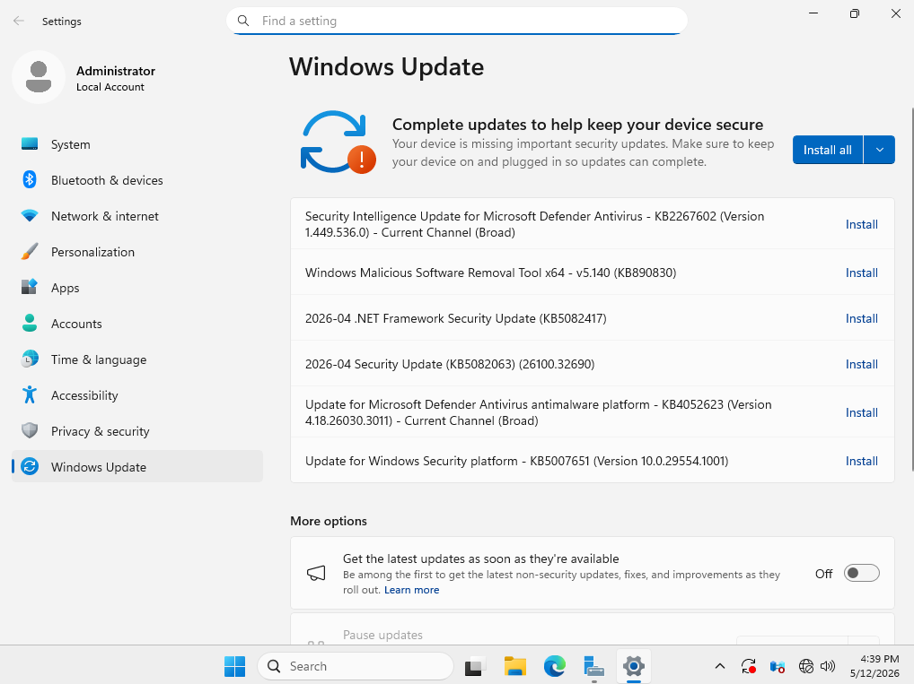
