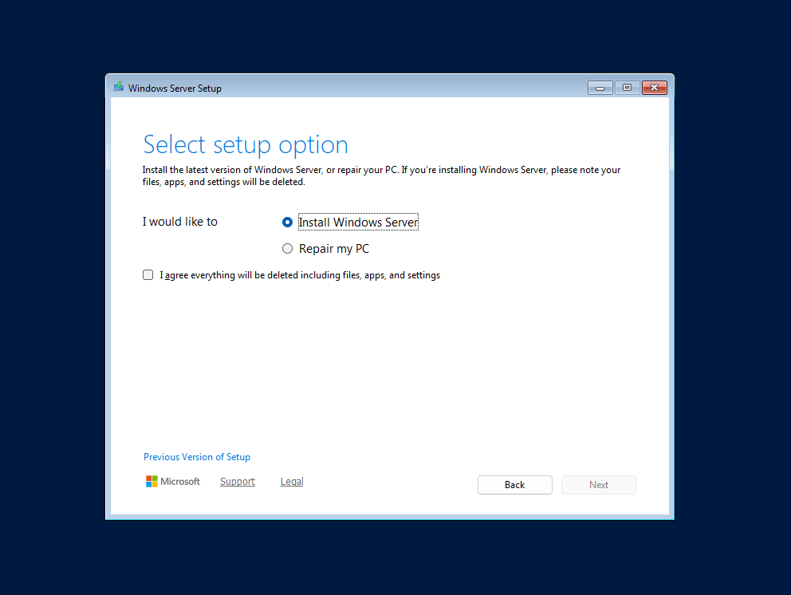
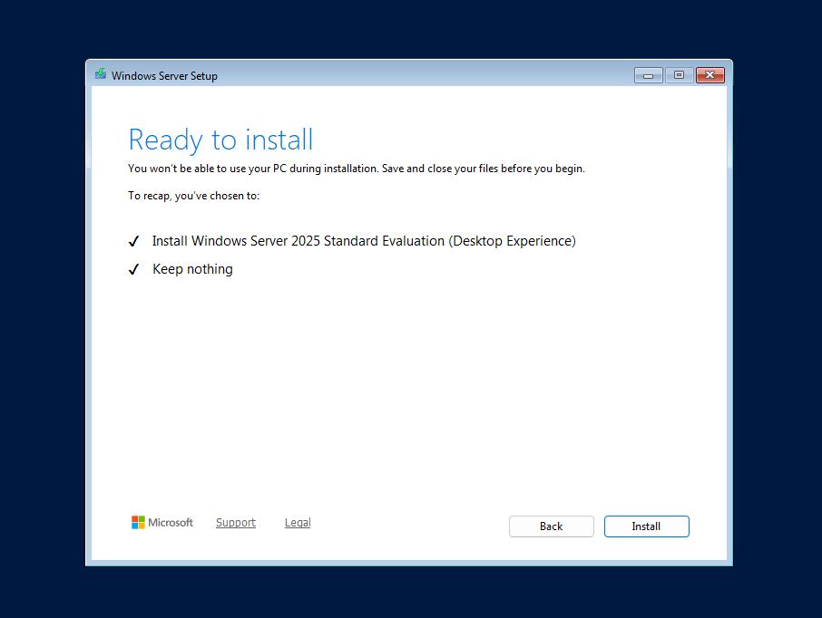
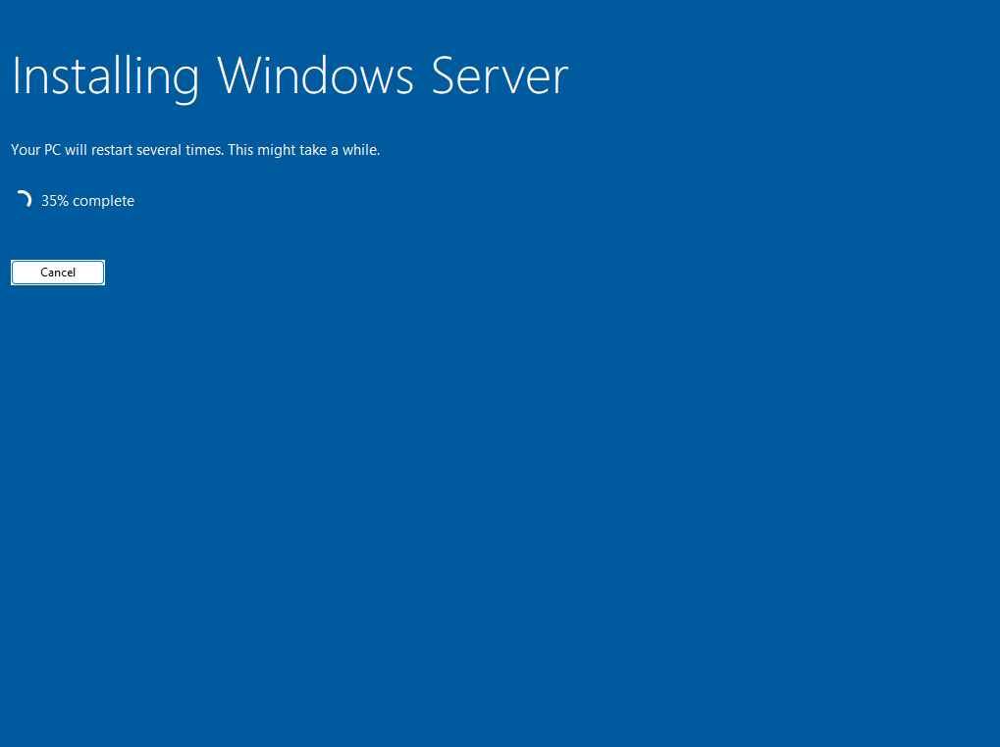
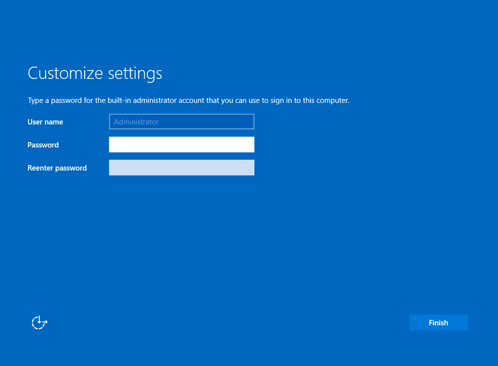
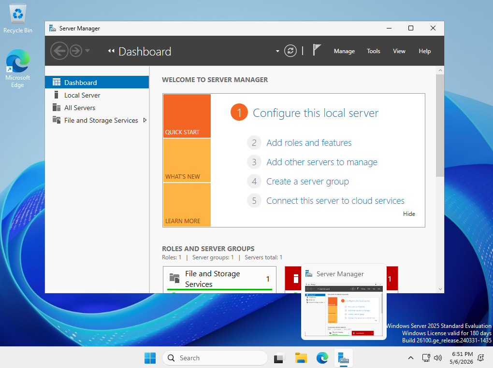

# Overview
This guide is meant to be a step by step walkthrough of a fresh installation of Windows Server 2025. The goal is to provide a clear overview of how to properly install the operating system and prepare it for use. Note that this guide only covers the actual installation of the OS and not the initial hypervisor steps.

# Background
- The installation will be peformed via virtualization using a hypervisor and an ISO image
- The hypervisor being used is VMware Workstation Pro
  - The hypervisor can be downloaded for free from [here](https://www.vmware.com/products/desktop-hypervisor/workstation-and-fusion)
  - Note that you must register for a Broadcom account in order to download VMware Workstation Pro
- The ISO image for the Windows Server 2025 operating system comes directly from Microsoft, using their free, 180 day evaluation
  - You can find more information and a download for the ISO image [here](https://www.microsoft.com/en-us/evalcenter/evaluate-windows-server-2025)
  
# Steps
1. Upon booting into Windows, you will first be prompted to choose your preferred language settings. In this case I kept the default settings of **English (United States)**. Once done, click next
   
    

2. Next, you will be prompted to select the preferred language for your keyboard settings. I have kept it as the default setting of **US** English.
   
    

3. At this stage, you will have the option to select whether you would like to perform an install or a repair. **Install Windows Server** will allow you proceed with a fresh install of the OS while **Repair my PC** allows you to run **Windows Startup Repair**, which is a builtin recovery tool that automatically fixes common issues preventing Windows from booting. 
   
   Since we are working on a fresh install, we will go ahead and select **Install Windows Server** and proceed with Next.
   
   Note that you must also check off the **I agree everything will be deleted including files, apps, and settings** before proceeding as a fresh install will overwrite data from a previous installation if present. 

    

4. At this step you will be presented with a list of available operating system editions contained within the ISO file to install. If you prefer a command line based environment, you'll want to stick with just the **Standard Evaluation**. If you wish to have a GUI with a desktop, you'll want to select a **Desktop Experience** option. 
   
   For this example, we will select the **Windows Server 2025 Standard Evaluation (Desktop Experience)** option which will give us a proper desktop.

    

5. Next, you'll be presented with a license agreement which you will need to **Accept** before proceeding.

    

6. Here you will decide where you want to install Windows. If no disks appear, you may need to load/install drivers for your specific storage device. If this does not pertain to you, simply select which drive you would like to install Windows onto. You can also choose to partition the drive as well if need be.
   
   To keep things simple, we will just select **Disk 0** and proceed forward without partitioning. 

    

7. Windows will now double check and prompt if you are ready to install. Ensure your chosen settings are correct. If all looks good, click **Install** to begin the installation process.

    

    

8. Once the installation is complete, you will be presented with a page that allows you to set the password for a built in administrator account. This account is a local administrator that you will use to initially log in. 

    

9. Log in as the local **Administrator** account with the password you set. Once logged in, you should be taken to the Desktop which will present Server Manager. At this point, installation is now fully complete and you have a working base installation of Windows Server 2025. Moving forward, you can create additional users and configure domain settings as needed for your environment.

    
