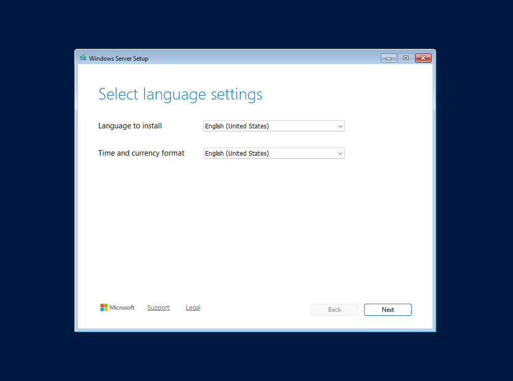

# Overview
This guide is meant to be a step by step walkthrough of a fresh installation of Windows Server 2025. The goal is to provide a clear overview of how to properly install the operating system and prepare it for use.

# Steps
1. Upon booting into Windows, you will first be prompted to choose your preferred language settings. In this case I kept the default settings of **English (United States)**. Once done, click next
   

2. Next, you will be prompted to select the preferred language for your keyboard settings. I have kept it as the default setting of **US** English.
   

3.